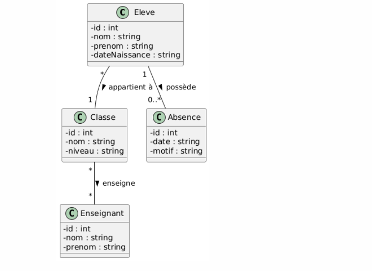
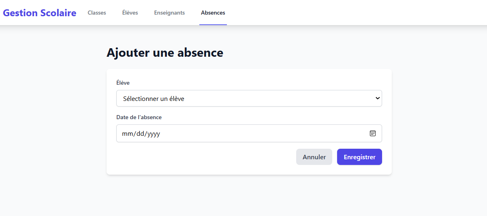
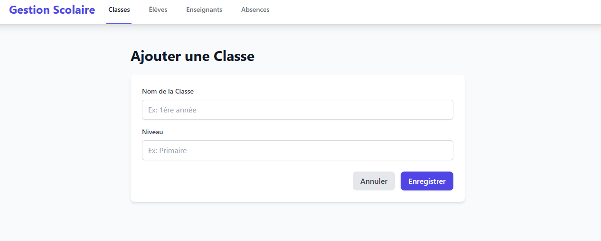
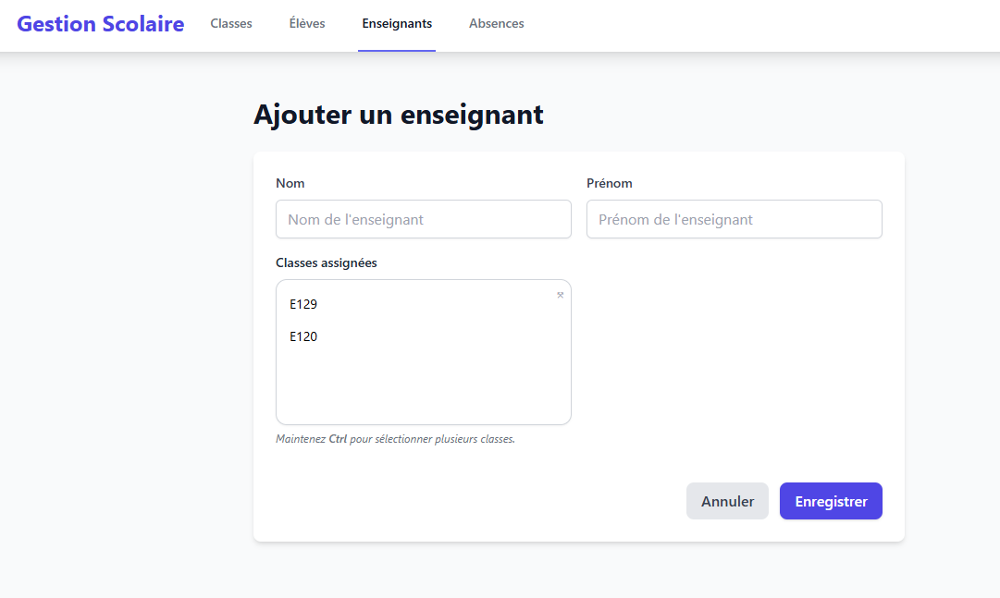
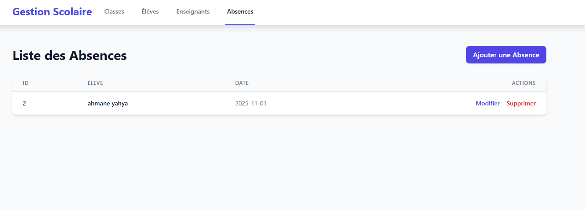
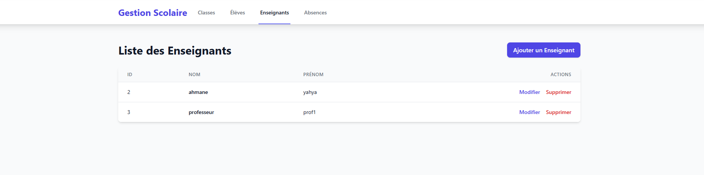

# Rapport du Projet Atelier 6 : Gestion des Absences

## Introduction

Cet atelier consiste à développer une application web pour gérer les absences des étudiants d'une école maternelle. L'objectif est de fournir une interface utilisateur intuitive et des fonctionnalités robustes pour gérer les entités principales telles que les élèves, les enseignants, les classes, et les absences. Ce rapport détaille les étapes de développement, les entités JPA, les couches de service et de contrôleur, ainsi que les interfaces utilisateur.

---

## Étape 1 : Diagramme de classe



---

## Étape 2 : Entités JPA

Voici les entités JPA créées pour ce projet :

### 1. `Absence`
```java
package ma.fstt.atelier6.entities;

import jakarta.persistence.*;
import lombok.*;

@Entity
@NoArgsConstructor
@AllArgsConstructor
@Getter
@Setter
@Builder
public class Absence {
    @Id
    @GeneratedValue(strategy = GenerationType.IDENTITY)
    private Long id;
    private String date;

    @ManyToOne
    @JoinColumn(name = "eleve_id")
    private Eleve eleve;
}
```

### 2. `Classe`
```java
package ma.fstt.atelier6.entities;

import jakarta.persistence.*;
import lombok.*;

import java.util.ArrayList;
import java.util.List;

@Entity
@Getter
@Setter
@NoArgsConstructor
@AllArgsConstructor
@Builder
public class Classe {
    @Id
    @GeneratedValue(strategy = GenerationType.IDENTITY)
    private Long id;
    private String nom;
    private String niveau;

    @OneToMany(mappedBy = "classe")
    private List<Eleve> eleve;

    @ManyToMany(mappedBy = "classes")
    private List<Enseignant> enseignant;
}
```

### 3. `Eleve`
```java
package ma.fstt.atelier6.entities;

import jakarta.persistence.*;
import lombok.*;

import java.util.List;

@Entity
@NoArgsConstructor
@AllArgsConstructor
@Getter @Setter
@Builder
public class Eleve {
    @Id
    @GeneratedValue(strategy = GenerationType.IDENTITY)
    private Long id;
    private String nom;
    private String prenom;
    private String dateNaissance;

    @ManyToOne
    @JoinColumn(name = "classe_id")
    private Classe classe;

    @OneToMany(mappedBy = "eleve")
    private List<Absence> absences;
}
```

### 4. `Enseignant`
```java
package ma.fstt.atelier6.entities;

import jakarta.persistence.*;
import lombok.*;

import java.util.ArrayList;
import java.util.List;

@Entity
@NoArgsConstructor
@AllArgsConstructor
@Getter
@Setter
@Builder
public class Enseignant {
    @Id
    @GeneratedValue(strategy = GenerationType.IDENTITY)
    private Long id;
    private String nom;
    private String prenom;

    @ManyToMany
    @JoinTable(
            name = "classe_enseignant",
            joinColumns = @JoinColumn(name = "enseignant_id"),
            inverseJoinColumns = @JoinColumn(name = "classe_id")
    )
    private List<Classe> classes = new ArrayList<>();
}
```

---

## Étape 3 : Couche Repository

Chaque entité dispose d'un repository pour interagir avec la base de données. Par exemple :

```java
@Repository
public interface EleveRepository extends JpaRepository<Eleve, Long> {
}
```

---

## Étape 4 : Couche Service

La couche service contient des interfaces et leurs implémentations pour gérer la logique métier. Exemple pour les élèves :

### Interface
```java
public interface EleveService {
    List<Eleve> getAllEleves();
    Eleve saveEleve(Eleve eleve);
    void deleteEleve(Long id);
}
```

### Implémentation
```java
@Service
public class EleveServiceImpl implements EleveService {
    @Autowired
    private EleveRepository eleveRepository;

    @Override
    public List<Eleve> getAllEleves() {
        return eleveRepository.findAll();
    }

    @Override
    public Eleve saveEleve(Eleve eleve) {
        return eleveRepository.save(eleve);
    }

    @Override
    public void deleteEleve(Long id) {
        eleveRepository.deleteById(id);
    }
}
```

---

## Étape 5 : Couche Contrôleur

Les contrôleurs utilisent Spring MVC pour gérer les requêtes HTTP. Exemple pour les élèves :

```java
@Controller
@RequestMapping("/eleves")
public class EleveController {
    @Autowired
    private EleveService eleveService;

    @GetMapping
    public String listEleves(Model model) {
        model.addAttribute("eleves", eleveService.getAllEleves());
        return "eleves";
    }

    @GetMapping("/new")
    public String showEleveForm(Model model) {
        model.addAttribute("eleve", new Eleve());
        return "eleve-form";
    }

    @PostMapping
    public String saveEleve(@ModelAttribute Eleve eleve) {
        eleveService.saveEleve(eleve);
        return "redirect:/eleves";
    }
}
```

---

## Étape 6 : Interfaces utilisateur (IHM)

Les vues Thymeleaf permettent de créer des interfaces utilisateur. Exemple pour la liste des élèves :

### `eleves.html`
```html
<!DOCTYPE html>
<html xmlns:th="http://www.thymeleaf.org">
<head>
    <title>Liste des élèves</title>
</head>
<body>
<h1>Liste des élèves</h1>
<table>
    <tr>
        <th>Nom</th>
        <th>Prénom</th>
        <th>Date de Naissance</th>
    </tr>
    <tr th:each="eleve : ${eleves}">
        <td th:text="${eleve.nom}"></td>
        <td th:text="${eleve.prenom}"></td>
        <td th:text="${eleve.dateNaissance}"></td>
    </tr>
</table>
<a href="/eleves/new">Ajouter un élève</a>
</body>
</html>
```

---

## Captures d'écran

### Ajout d'une absence


### Ajout d'une classe


### Ajout d'un enseignant


### Liste des classes


### Liste des absences


### Liste des enseignants


---

## Conclusion

Ce projet met en œuvre les concepts fondamentaux de Spring Boot, JPA, et Thymeleaf pour créer une application web complète. Il offre une gestion efficace des absences et des élèves, tout en respectant les bonnes pratiques de développement.
